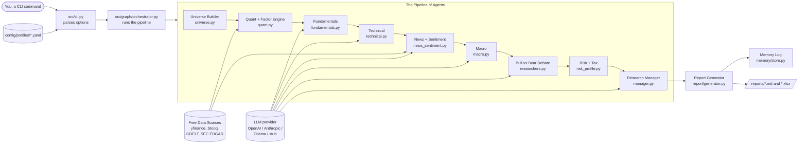
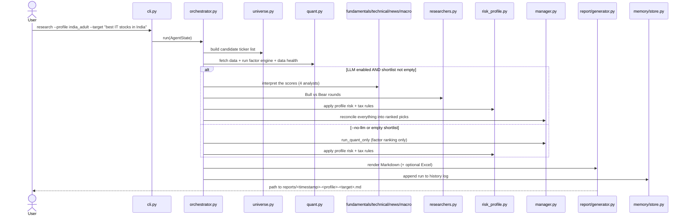

# Full Workflow Explanation — Finance Research Agent (FRA)

> A plain-language blueprint of how this project works, from the moment you type
> a command to the moment a report lands on disk. Written so that **anyone** —
> even with zero coding background — can follow along. Every section points at
> the **real files and functions** that do the work, so a developer can dive in too.

> **Disclaimer (straight from the project).** This software produces
> educational/research output. It is **not financial advice**, places **no real
> orders**, and uses **free public data** that may be stale or wrong. Always
> verify before acting.

---

## 0. TL;DR — Explain It Like I'm 5

Imagine you ask a very careful research team a question like *"What are the best
IT companies to invest in, in India?"*

1. A **librarian** figures out which companies you might mean (e.g. the big
   Indian IT firms) and makes a list.
2. A **calculator robot** downloads free public numbers about each company
   (profits, debt, price trends) and scores them on five qualities, with no
   opinions — just math. It also prints a "how trustworthy is this data?" sticker.
3. A panel of **AI analysts** reads those scores and writes short, evidence-based
   opinions. They are **forbidden from making up numbers** — they can only talk
   about the numbers the robot already produced.
4. Two AIs hold a short **debate** (one optimistic "Bull", one cautious "Bear").
5. A **risk & tax checker** adds rules specific to you (e.g. Indian capital-gains
   tax, or "you're a German student, keep it low-risk").
6. A **manager** combines everything into a final ranked list and writes you a
   tidy **report** (a Markdown file, plus an optional Excel spreadsheet).

You get back a ranked shortlist of stocks with reasons, risks, and tax notes.
Nothing is bought; it's purely research.

---

## 1. Overview — What This Project Does and Why

The **Finance Research Agent (FRA)** is a command-line program that ranks the
"best" stocks to research for a given theme (for example, *"best IT stocks in
India"* or a single ticker like `SAP.DE`). It blends **deterministic financial
math** (which is reproducible and never guesses) with **AI language models**
(which explain and contextualize the math). The result is a written investment
research report tailored to one of two **investor profiles**: an Indian adult
investor, or a German student investor.

The core idea: **numbers come from real data and formulas; AI only interprets
them.** This makes the output more trustworthy than asking a chatbot to "pick
stocks," because the AI is never allowed to invent figures.

---

## 2. Key Concepts / Glossary

| Term | Plain-language meaning |
|---|---|
| **CLI** (Command-Line Interface) | A program you run by typing a command in a terminal, instead of clicking buttons. Here it's `python -m src.cli ...`. |
| **Ticker** | A stock's short code, e.g. `INFY.NS` (Infosys on India's NSE) or `SAP.DE` (SAP on Germany's Xetra). |
| **Universe** | The full list of candidate companies to consider before narrowing down (e.g. all NIFTY 500 companies). |
| **Profile** | A saved set of preferences for one kind of investor (country, currency, tax rules, how much risk, what to emphasize). Stored as YAML files in `config/profiles/`. |
| **Factor** | A measurable "quality" of a company. FRA uses five: **Quality, Value, Momentum, Financial Health, Earnings Quality**. |
| **Factor engine** | The deterministic calculator that scores every company on each factor and ranks them. No AI involved. |
| **Composite score** | A single 0–1 number combining the five factors using the profile's chosen weights. Higher = ranks better. |
| **Percentile rank** | "Better than X% of the others." Each company is scored relative to its peers in the universe, not on an absolute scale. |
| **LLM** (Large Language Model) | An AI that reads and writes text (e.g. GPT, Claude, or a local Llama model via Ollama). Here, LLMs play the role of "analysts." |
| **Agent** | A single specialized worker in the pipeline (e.g. the "fundamentals analyst" or the "universe builder"). Some agents use an LLM; many are pure math. |
| **Pipeline / orchestrator** | The conveyor belt that runs the agents in the right order and passes data between them. |
| **Snapshot** (`CompanySnapshot`) | A standardized bundle of one company's data (price, margins, debt, momentum, etc.). |
| **Data health card** | A traffic-light summary (OK / WARN / CRITICAL) telling you how complete and trustworthy this run's data was. |
| **Debate (Bull vs Bear)** | Two AI researchers argue the optimistic vs cautious case, so the report shows both sides. |
| **Coverage** | The fraction of expected data fields that were actually available for a company. Low coverage → the score is "shrunk" toward neutral. |
| **MCP** (Model Context Protocol) | A standard way for AI tools to call external data/tools. *Not currently wired into FRA* — the code note in `src/data/provider.py` mentions you *could* swap the data layer for MCP servers, but the shipped version uses yfinance/Stooq directly. |

---

## 3. High-Level Architecture

FRA is a **chain of agents**. Data starts as your typed question and flows
through each stage, getting richer at every step, until it becomes a report.
A single shared object — the `AgentState` (defined in `src/graph/state.py`) —
is the "clipboard" that travels through the whole chain, accumulating results.



**Three layers, in plain terms:**

- **Perception (get data):** `src/data/` — fetches numbers and news from free
  sources and caches them on disk.
- **Brain (think):** `src/factors/` (deterministic math) + `src/agents/`
  (AI interpretation + debate).
- **Action (write it down):** `src/report/` (Markdown/Excel) + `src/memory/`
  (a running log of past runs).

The README sums the whole thing up in one line:

```36:36:README.md
`Universe -> DataProvider -> FactorEngine -> Analysts -> Bull/Bear Debate -> Risk+Profile -> Manager -> Report`
```

---

## 4. The End-to-End Workflow, Stage by Stage

The orchestrator runs the stages below. With LangGraph installed it uses a real
graph; otherwise it falls back to a plain sequential runner — **both run the
exact same stages**. See `_seq_run` and `_build_langgraph` in
`src/graph/orchestrator.py`.



### Stage 0 — You run a command (entry point)
- **Triggered by:** you typing a command in a terminal.
- **Input:** options like `--profile`, `--target`, `--top`, `--no-llm`.
- **What happens:** `src/cli.py` (built with the `typer` library) parses your
  options. The `research` command loads the chosen profile YAML via
  `load_profile` (`src/config.py`) and packs everything into a fresh
  `AgentState` object, then calls `run` from the orchestrator.
- **Produces:** an `AgentState` and a console banner.
- **Other commands:** `history` (list past runs), `backtest` (a price-only
  walk-forward sanity check), `profiles` (list available profiles).
- **Implemented in:** `research()` in `src/cli.py`; `AgentState` in
  `src/graph/state.py`.

### Stage 1 — Universe Builder (figure out which companies)
- **Triggered by:** the orchestrator, first stage.
- **Input:** your free-text `--target`, optional `--universe`/`--domain`, and the profile.
- **What it does (plain language):** decides whether you typed a single ticker
  (e.g. `SAP.DE`) or a theme (e.g. "best banks in India"). For a theme, it
  detects the sector from keywords (a hard-coded map like `bank`→Financials,
  `software`/`tech`→Information Technology) and pulls the matching companies
  from the relevant index list. It tries **live** constituents first
  (`universe_live.py`, e.g. NSE/Wikipedia) and falls back to **seeded** lists in
  `src/data/india.py` or `src/data/germany_global.py`. No AI here — it's all rules.
- **Produces:** `candidate_tickers` and `candidate_meta` on the state.
- **Implemented in:** `run()` in `src/agents/universe.py` (`_detect_sector`,
  `_candidate_pool`, `_filter_by_sector`).

### Stage 2 — Quant + Factor Engine (the deterministic calculator)
This is the analytical heart and the most important stage.
- **Triggered by:** runs right after the universe is built.
- **Input:** the candidate tickers + the profile.
- **What it does:**
  1. **Fetch a snapshot per ticker** using `DataProvider.get_snapshot`
     (`src/data/provider.py`). Primary source is **yfinance**; it cross-checks
     the latest price against **Stooq** (free CSV) to compute a per-ticker
     "data agreement" score. All fetches are cached on disk (`.fra_cache/`).
  2. **Flag cross-currency picks** (e.g. a US stock for a German investor).
  3. **Apply hard risk constraints** from the profile (minimum market cap,
     maximum volatility) — see `_passes_constraints`.
  4. **Build the Data Health card** (`build_card` in `src/data/health.py`):
     how many tickers fetched, average coverage, source agreement, and a
     severity of OK/WARN/CRITICAL.
  5. **Run the factor engine** (`rank_universe` in `src/factors/engine.py`):
     for each of the five factors it extracts metrics (`src/factors/metrics.py`),
     **percentile-ranks** each metric across the universe (`src/factors/scoring.py`),
     averages them into a factor score, then combines factors using the
     profile's **weights** into a **composite score**. Low-coverage companies
     have their composite shrunk toward the neutral 0.5. It also computes
     **profile fit** (cosine similarity vs your weights), **factor std-dev**
     (how lopsided a pick is), and **floor breaches** (factors below a threshold).
  6. **Factor regime check** (`src/factors/decay.py`): flags factors that have
     recently underperformed.
  7. **Compute a reproducible `input_hash`** so an identical re-run is verifiable.
- **Produces:** `snapshots`, `factor_reports`, `shortlist` (top-N tickers),
  `data_health`, `factor_regime`, `input_hash`.
- **Implemented in:** `run()` in `src/agents/quant.py`; engine in
  `src/factors/engine.py`.

> **Decision point:** after this stage the orchestrator calls `should_run_llm`
> (`src/graph/conditional_logic.py`). If you passed `--no-llm`, **or** the
> shortlist is empty, it **skips** all the AI stages and jumps straight to a
> deterministic manager (`manager.run_quant_only`) → risk → report. Otherwise it
> proceeds through the AI analysts below.

### Stage 3 — Analyst Agents (AI interprets the numbers)
Four analysts run in sequence. Each builds a compact data bundle from the
shortlist (`shortlist_context` in `src/agents/_common.py`), asks the LLM to
reason **only over the provided numbers**, and falls back to a deterministic
heuristic if the LLM is unavailable or returns junk. The shared system prompt
(`SYSTEM_RULES`) forbids inventing numbers and requires citing the metric behind
each claim.

- **3a. Fundamentals** (`src/agents/fundamentals.py`): judges Quality, Value,
  Financial Health, Earnings Quality. Also pulls a best-effort **insider-trading
  signal** from SEC EDGAR (`src/data/insiders_edgar.py`, US tickers only).
  A self-check (`grade_rationale`) lowers confidence if the AI's text isn't
  grounded in a real number.
- **3b. Technical** (`src/agents/technical.py`): interprets price momentum and
  volatility into a trend stance.
- **3c. News + Sentiment** (`src/agents/news_sentiment.py`): pulls headlines
  from **GDELT** (`src/data/news_gdelt.py`), falling back to yfinance news, and
  classifies aggregate sentiment.
- **3d. Macro** (`src/agents/macro.py`): writes one short, universe-wide
  context paragraph for the profile's country/currency.
- **Produces:** a list of `analyst_signals` (each: role, ticker, score, stance,
  confidence, rationale, evidence) appended to the state.

### Stage 4 — Bull vs Bear Debate
- **Triggered by:** runs after the analysts, repeated for `--rounds` rounds
  (default 1).
- **What it does:** two LLM personas — a **Bull** (optimist) and a **Bear**
  (skeptic) — each read all analyst signals + factor scores + the prior debate
  turns, and write a focused case for the 2–3 most compelling/concerning names.
- **Produces:** a list of `debate` turns on the state.
- **Implemented in:** `run()` in `src/agents/researchers.py`.

### Stage 5 — Risk + Profile/Tax
- **What it does:** deterministically applies profile rules: position
  concentration cap, ETF preference, volatility filter notes, and **tax notes**
  copied verbatim from the profile YAML (Indian STCG/LTCG, or German
  Abgeltungssteuer / Sparerpauschbetrag). Tax rules live in YAML so they can be
  updated without touching code.
- **Produces:** `risk_notes` and `tax_notes` on the state.
- **Implemented in:** `run()` in `src/agents/risk_profile.py`.

### Stage 6 — Research Manager (final reconciliation)
- **What it does:** combines factor scores + analyst signals + the debate into a
  final ranked list of `FinalPick`s, each with a 2–3 sentence thesis (citing
  real metrics), key risks, confidence, a suggested holding horizon, and
  per-pick tax notes. It also computes an **estimated after-tax return**
  (`src/factors/after_tax.py`) and **backfills** any shortlisted ticker the LLM
  forgot, using the deterministic path. In `--no-llm` mode, `run_quant_only`
  produces picks straight from the factor engine.
- **Produces:** `picks` on the state.
- **Implemented in:** `run()` and `run_quant_only()` in `src/agents/manager.py`.

### Stage 7 — Report Generator
- **What it does:** renders the whole state into a Markdown report using the
  Jinja2 template `src/report/templates/report.md.j2`, and writes it to
  `reports/<timestamp>-<profile>-<target-slug>.md`. Unless `--no-excel` is set,
  it also writes a multi-sheet `.xlsx` (`src/report/excel.py`).
- **Produces:** `report_path` (and `excel_path`) on the state; files on disk.
- **Implemented in:** `generate_report()` in `src/report/generator.py`.

### Stage 8 — Memory Log
- **What it does:** appends a compact JSON record of the run (target, profile,
  picks, hash, data-health severity, paths) to `.fra_memory/index.jsonl`, so the
  `history` command can list past runs later.
- **Implemented in:** `persist_run()` in `src/memory/store.py`.

---

## 5. Inputs & Outputs

### What you provide
- `--profile` (required): `india_adult` or `germany_student`.
- `--target` (required): a ticker (`SAP.DE`) or a theme (`"best IT stocks in India"`).
- Optional: `--universe`, `--domain`, `--top` (default 10), `--rounds`,
  `--no-llm`, `--no-excel`, `--as-of YYYY-MM-DD`.

### What you get back
- A **Markdown report** in `reports/` and (optionally) an **Excel workbook**.
- A **console summary**: a "Top picks" table and a Data Health line.
- A **history entry** you can later list with `python -m src.cli history`.

### What the report contains (see the real example)
The example report
`reports/20260619-140733-india_adult-best-IT-companies-in-India.md` includes:
- A header (target, universe, top-N, **input hash**) and the disclaimer.
- A **Data health** card (e.g. *OK, 6/6 tickers fetched, 82% coverage*).
- **Factor regime warnings**.
- **Final Picks**, each with composite score, profile fit, coverage,
  factor std-dev, confidence, suggested horizon, after-tax return estimate,
  a thesis, key risks, and tax notes (e.g. TCS, Infosys, Tech Mahindra…).
- A **Factor breakdown** table (the five factor scores per pick).
- **Analyst signals**, the **Bull vs Bear debate** transcript, **Risk + profile
  notes**, **Tax notes**, and a **Methodology** section listing the factor weights.

---

## 6. Configuration & Setup

### Prerequisites
- Python (the project targets a modern Python 3 with `pydantic>=2.7`).
- Dependencies in `requirements.txt` (typer, rich, yfinance, pandas, numpy,
  requests, beautifulsoup4, langgraph, jinja2, openpyxl, plus optional
  `openai`/`anthropic`).
- *(Optional, for local AI)* [Ollama](https://ollama.com) running a model like
  `llama3.1:8b`.

### Install & run (Windows / PowerShell, per the README)
```bash
python -m venv .venv && .venv\Scripts\activate
pip install -r requirements.txt
copy .env.example .env

# Optional local LLM:
ollama pull llama3.1:8b
ollama serve

# Run a research pass:
python -m src.cli research --profile india_adult --target "best IT stocks in India" --top 10

# Offline / deterministic (no AI):
python -m src.cli research --profile india_adult --target "best banks in India" --top 10 --no-llm
```

### Environment variables (`.env`, see `.env.example`)
| Variable | Purpose | Default |
|---|---|---|
| `LLM_PROVIDER` | `openai`, `anthropic`, `ollama`, or `cursor_io` | `ollama` |
| `LLM_MODEL` | provider-specific model name | `llama3.1:8b` |
| `LLM_TEMPERATURE` | randomness (0 = deterministic) | `0` |
| `OPENAI_API_KEY` / `ANTHROPIC_API_KEY` | keys for hosted LLMs | empty |
| `OLLAMA_HOST` | local Ollama endpoint | `http://localhost:11434` |
| `FRA_CACHE_DIR` | where data is cached | `./.fra_cache` |

> **No API key? It still runs.** If no LLM is reachable, `get_llm()` in
> `src/llm/factory.py` returns a deterministic **stub**, and every analyst falls
> back to its math-based heuristic. You still get a valid factor-based report —
> just with sparser AI prose.

### Where things live (config-as-data)
Profile YAMLs in `config/profiles/` control the universe defaults, **factor
weights**, **tax rules**, **risk constraints**, and currency — so most behavior
can be tuned **without editing Python**. The two shipped profiles:
- `config/profiles/india_adult.yaml` — INR, NIFTY-based, momentum-tilted, Indian capital-gains tax.
- `config/profiles/germany_student.yaml` — EUR, DAX/MDAX, quality/health-tilted, lower risk, Abgeltungssteuer.

---

## 7. Concrete Walkthrough — One Real Request

Command:
```bash
python -m src.cli research --profile india_adult --target "best IT companies in India" --top 10
```

1. **`cli.py`** loads `india_adult.yaml`, builds the `AgentState`, prints the
   banner (profile/target/universe/top), and calls `orchestrator.run`.
2. **Universe** (`universe.py`): detects the **Information Technology** sector
   from the word "IT", pulls the India IT names, and yields candidates like
   `TCS.NS`, `INFY.NS`, `TECHM.NS`, `WIPRO.NS`, `HCLTECH.NS`, `LTIM.NS`.
3. **Quant** (`quant.py`): fetches a snapshot for each via yfinance (+ Stooq
   cross-check), builds the Data Health card (the example shows **OK, 6/6
   fetched, 82% coverage, single-source mode**), and runs the factor engine.
   It computes an input hash (`1aceed39273729da` in the example).
4. **Analysts** read the scores. For TCS, fundamentals is **bullish** (ROE 48.4%,
   operating margin 25.3%, PE 15.3); technical is **bearish** (12-1m momentum
   −31.9%); news is **bearish** (a $70m legal hit + sector weakness). Each claim
   cites a real number from step 3.
5. **Debate**: the Bull argues "world-class franchises after a reset"; the Bear
   argues "the cycle is still rolling over." Both transcripts appear in the report.
6. **Risk + Tax**: adds "10% per-name cap", "volatility > 60% filtered", and
   Indian LTCG/STCG notes.
7. **Manager**: produces the ranked picks (TCS #1, Infosys #2, …), each with a
   thesis, risks, a suggested >12-month horizon, and an after-tax estimate
   (e.g. TCS +8.7% after tax). `LTIM.NS` had 0% data coverage, so it's a
   low-confidence **backfilled** news/catalyst-only entry — a good demonstration
   of how the system degrades gracefully.
8. **Report + Memory**: writes
   `reports/20260619-140733-india_adult-best-IT-companies-in-India.md` and logs
   the run to `.fra_memory/index.jsonl`. The console prints the Top-picks table,
   the input hash, and the report path.

---

## 8. Extension Points — How to Modify Behavior

| You want to… | Change this |
|---|---|
| Add a new investor profile | Add a YAML in `config/profiles/` (copy an existing one); it's auto-discovered by `profiles` and `load_profile`. |
| Change factor weights / tax rates / risk limits | Edit the relevant `config/profiles/*.yaml`. No code change needed. |
| Add or change a factor | Add an extractor in `src/factors/metrics.py` (register it in `FACTORS`); the engine in `src/factors/engine.py` picks it up. |
| Swap the data source (e.g. to an MCP server or paid API) | Re-implement the `DataProvider` interface in `src/data/provider.py`; the rest of the pipeline is unchanged. |
| Add a new analyst | Create a module in `src/agents/` exposing `run(state)`, then wire it into `_seq_run` and `_build_langgraph` in `src/graph/orchestrator.py`. |
| Change the report layout | Edit the Jinja2 template `src/report/templates/report.md.j2` (Markdown) or `src/report/excel.py` (Excel). |
| Use a different / no LLM | Set `LLM_PROVIDER` in `.env`, or pass `--no-llm` for a deterministic run. |
| Tune debate depth | Pass `--rounds N`. |
| Add CLI options or commands | Edit `src/cli.py` (it uses `typer`). |

---

## 9. Reusable Blueprint Template (for documenting any similar pipeline)

This document followed a repeatable skeleton you can reuse for any
data-or-agent pipeline:

1. **TL;DR / ELI5** — one analogy a non-technical reader can grasp.
2. **Overview** — what & why in 2–3 sentences.
3. **Glossary** — define every piece of jargon.
4. **Architecture** — components + a diagram + the 3-layer (perceive/think/act) framing.
5. **Stage-by-stage workflow** — for each stage: *trigger → input → what it does
   → output → which file/function implements it* + a flow/sequence diagram.
6. **Inputs & Outputs** — what the user gives and gets (with a real example).
7. **Configuration & Setup** — prerequisites, env vars, install/run.
8. **Concrete walkthrough** — trace one real request end to end.
9. **Extension points** — a "to change X, edit Y" table.

---

*File map (quick reference): `src/cli.py` (entry) · `src/graph/orchestrator.py`
(pipeline) · `src/graph/state.py` (shared state) · `src/agents/*` (workers) ·
`src/factors/*` (deterministic math) · `src/data/*` (data sources + caching) ·
`src/llm/factory.py` (LLM providers) · `src/report/*` (output) ·
`src/memory/store.py` (history) · `config/profiles/*.yaml` (settings).*
